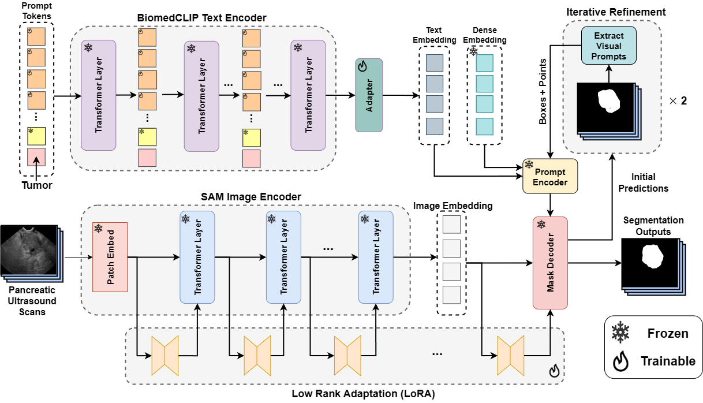

# TextSAM-EUS: Text Prompt Learning for SAM to Accurately Segment Pancreatic Tumor in Endoscopic Ultrasound
**[Health-X Lab](http://www.healthx-lab.ca/)** | **[IMPACT Lab](https://users.encs.concordia.ca/~impact/)** 

[Pascal Spiegler](https://scholar.google.com/citations?user=FoihFT0AAAAJ&hl=en), [Taha Koleilat](https://tahakoleilat.github.io/), [Arash Harirpoush](https://scholar.google.com/citations?user=-jhPnlgAAAAJ&hl=en), [Corey S. Miller](https://www.mcgill.ca/gastroenterology/corey-miller), [Hassan Rivaz](https://users.encs.concordia.ca/~hrivaz/), [Marta Kersten-Oertel](https://www.martakersten.ca/), [Yiming Xiao](https://yimingxiao.weebly.com/curriculum-vitae.html)

[](https://www.arxiv.org/abs/2507.18082)
[](#overview)
[](https://www.spiedigitallibrary.org/conference-proceedings-of-spie/11583/2581321/Endoscopic-ultrasound-database-of-the-pancreas/10.1117/12.2581321.short)
[](https://drive.google.com/file/d/152U8ZilljXfGSqwN3m77JQpKLXR7mZR0/view)
[](#citation)

## Overview

> **<p align="justify"> Abstract:** *Pancreatic cancer carries a poor prognosis and relies on endoscopic ultrasound (EUS) for targeted biopsy and radiotherapy. However, the speckle noise, low contrast, and unintuitive appearance of EUS make segmentation of pancreatic tumors with fully supervised deep learning (DL) models both error-prone and dependent on large, expert-curated annotation datasets. To address these challenges, we present **TextSAM-EUS**, a novel, lightweight, text-driven adaptation of the Segment Anything Model (SAM) that requires no manual geometric prompts at inference. Our approach leverages text prompt learning (context optimization) through the BiomedCLIP text encoder in conjunction with a LoRA-based adaptation of SAM’s architecture to enable automatic pancreatic tumor segmentation in EUS, tuning only 0.86% of the total parameters. On the public Endoscopic Ultrasound Database of the Pancreas, **TextSAM-EUS** with automatic prompts attains 82.69% Dice and 85.28% normalized surface distance (NSD), and with manual geometric prompts reaches 83.10% Dice and 85.70% NSD, outperforming both existing state-of-the-art (SOTA) supervised DL models and foundation models (e.g., SAM and its variants). As the first attempt to incorporate prompt learning in SAM-based medical image segmentation, **TextSAM-EUS** offers a practical option for efficient and robust automatic EUS segmentation. Our code will be publicly available upon acceptance.* </p>

## Method



## Segmentation Results


## Installation 
This codebase is tested on Ubuntu 20.04.2 LTS with python 3.10. Follow the below steps to create environment and install dependencies.

* Setup conda environment (recommended).
```bash
# Create a conda environment
conda create -n textsam_eus python=3.10 -y

# Activate the environment
conda activate textsam_eus

# Install torch (requires version >= 2.1.2) and torchvision
# Please refer to https://pytorch.org/ if you need a different cuda version
pip install torch==2.1.2 torchvision==0.16.2 --index-url https://download.pytorch.org/whl/cu118

```
* Clone TextSAM-EUS code repository and install requirements
```bash
# Clone MaPLe code base
git clone https://github.com/HealthX-Lab/TextSAM-EUS

cd TextSAM-EUS/
# Install requirements

pip install -e .
```

## Data preparation

* Download the dataset [following the paper of Jaramillo et al. (2020)](https://www.spiedigitallibrary.org/conference-proceedings-of-spie/11583/2581321/Endoscopic-ultrasound-database-of-the-pancreas/10.1117/12.2581321.short).

* Place dataset under `data` like the following:
```
data/
|–– EUS/
|   |–– train/
|   |   |–– images/
|   |   |–– masks/
|   |–– val/
|   |   |–– images/
|   |   |–– masks/
|   |–– test/
|   |   |–– images/
|   |   |–– masks/
```

## Training and Evaluation
* Run the training and evaluation script

```bash
bash scripts/pipeline.sh EUS outputs
```

* You can change some design settings in the [config](https://github.com/HealthX-Lab/PanTumorUSSeg/blob/main/configs/EUS.yaml).

## Citation
If you use our work, please consider citing:
```bibtex
@inproceedings{spiegler2025textsam,
  title={Textsam-eus: Text prompt learning for sam to accurately segment pancreatic tumor in endoscopic ultrasound},
  author={Spiegler, Pascal and Koleilat, Taha and Harirpoush, Arash and Miller, Corey S and Rivaz, Hassan and Kersten-Oertel, Marta and Xiao, Yiming},
  booktitle={Proceedings of the IEEE/CVF International Conference on Computer Vision},
  pages={948--957},
  year={2025}
}
```

## Acknowledgements

Our code builds upon the [open_clip](https://github.com/mlfoundations/open_clip), [segment-anything](https://github.com/facebookresearch/segment-anything), and [MaPLe](https://github.com/muzairkhattak/multimodal-prompt-learning) repositories. We are grateful to the authors for making their code publicly available. If you use our model or code, we kindly request that you also consider citing these foundational works.
